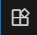
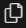
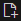

# Webサイト制作はじめの一歩
## <span class="eventName">つくって学ぶ！<span class="eventWeb">はじめてのWebサイトづくり</span> 2DAYS</span>

---

## 今日やること

1.  **Webページの仕組みを知る** (HTML, CSS, JavaScriptって何？)
2.  **部品を組み合わせてLP(ランディングページ)を作ってみる**
3.  **作ったページを自分流にカスタマイズする**

**ゴール：** プログラミングの楽しさを体験し、「自分でも作れる！」を実感する！

---

## Webページってどうやってできてるの？

Webページは、主に3つの言語の組み合わせでできています。

-   **HTML** → **骨組み**担当
-   **CSS** → **見た目**担当
-   **JavaScript** → **動き**担当

---

### **HTML**って何?
#### > ページの「骨組み」を作る言語

-   HyperText Markup Languageの略
-   見出し、段落、画像などの「構造」を指定する
-   「タイトルはこれです」「本文の次に画像を置きます」といった指示書

```html
<h1>こんにちは！</h1>
<p>これは私のウェブサイトです。</p>

```

---

### **HTML**: 実際のコードを分解してみよう

<div class="columns">
<div>

```html
<!DOCTYPE html>
<html lang="ja">
  <head>
      <meta charset="UTF-8">
      <title>私のウェブサイト</title>
  </head>
  <body>
      <h1>こんにちは！</h1>
      <p>これは私のウェブサイトです。</p>
  </body>
</html>
```
</div>
<div class="result">

<h1>こんにちは！</h1>
<p>これは私のウェブサイトです。</p>

</div>
</div>

---

### **HTML**の基本構造


```html
<タグ 属性="値">内容</タグ>
<タグ 属性="値" />
<!-- コメント -->
```

タグで囲って、中身を書く。属性(プロパティ)で細かい指定ができます。

中身がいらないタグ(画像など)は、閉じタグを省略できることがあります。その場合、閉じカッコを`/>`にします。

```html

```

---

### **HTML**の基本構造

```html
<!DOCTYPE html> <!-- HTML5で書かれていますよ、という宣言 -->
<html lang="ja"> <!-- ページ全体を囲んで、言語などを指定 -->
  <head>
    <!-- ページのプロパティを設定。デザインファイルと紐づけたり、タイトルを指定したり。 -->
  </head>
  <body>
    <!-- ページの中身を指定 -->
  </body>
</html>
```

htmlでページを作るときは、このような構造で書くことになっています。
`<!DOCTYPE html>`は特殊なタグです。それ以外は基本的なタグのルールに従っています。

---

### **HTML**: よく使うタグ

<div class="columns">
<div>

```html
<h1>大見出し</h1>
<h2>中見出し</h2>
<p>段落。<span>一部だけ</span>
  見た目を変えられます。</p>
<div>
  
  <p>divで複数のタグを囲めます</p>
</div>
```
</div>
<div class="result">

<h1>大見出し</h1>
<h2>中見出し</h2>
<p>段落。<span style="color: red; font-weight: bold;">一部だけ</span>
  見た目を変えられます。</p>
<div>
  
  <p>divで複数のタグを囲めます</p>
</div>

</div>
</div>

---

### **HTML**: よく使うタグ

<div class="columns">
<div>

```html
<h1>大見出し</h1>
<h2>中見出し</h2>
<h3>小見出し</h3>
<h4>見出し4</h4>
<h5>見出し5</h5>
<h6>見出し6</h6>
```

htmlでは、`h1`から`h6`までの6段階の見出しタグがあります。数字が小さいほど大きな見出しになります。
適切なタグを使っておくと、Googleなどが内容を理解して検索順位を上げてくれたり、画面読み上げソフトが正しく読み上げてくれたりします。

</div>
<div class="result">

<h1>大見出し</h1>
<h2>中見出し</h2>
<h3>小見出し</h3>
<h4>見出し4</h4>
<h5>見出し5</h5>
<h6>見出し6</h6>

</div>
</div>

---

### **HTML**: よく使うタグ

<div class="columns">
<div>

```html
<style>span{color: red;}</style>
<p>段落。<span>一部だけ</span>
  見た目を変えられます。</p>

<p>二段落目。段落の中で<br />
  無理やり改行することもできます。</p>

<p><strong>太字</strong>　<em>斜体</em>
  <mark>蛍光ペン</mark></p>
```
</div>
<div class="result">

<style scoped>span{color: red;}</style>
<p>段落。<span>一部だけ</span>
  見た目を変えられます。</p>
<p>二段落目。段落の中で<br>
  無理やり改行することもできます。</p>
<p><strong>太字</strong> <em>斜体</em>
  <mark>蛍光ペン</mark></p>

</div>
</div>

長めの文章を書くときは、`<p>`タグで囲みます。paragraphのpです。

段落の中で一部だけ見た目を変えるためのタグはいくつかあります。`<span>`は汎用的なタグで、それ単体ではスタイルはつきません。具体的なスタイルはCSSで指定します。書き方は後のスライドで。

`<br>`タグは段落の中に改行を入れたいときに使います。

---

### **HTML**: よく使うタグ

<div class="columns">
<div>

```html
<main>
  <h1>タイトル</h1>
  <div class="columns">
    <div class="section">
      <h2>セクション1</h2>
      <p>段落1</p>
    </div>

    <div class="section">
      <h2>セクション2</h2>
      <p>段落2</p>
      
    </div>
  </div>
</main>
```

</div>
<div class="result">

<style scoped>
.columns {
  display: flex;
  gap: 20px;
}
.section {
  flex: 1;
  border: 1px solid #ccc;
  padding: 10px;
}
</style>
<h1>タイトル</h1>
<div class="columns">
  <div class="section">
    <h2>セクション1</h2>
    <p>段落1</p>
  </div>

  <div class="section">
    <h2>セクション2</h2>
    <p>段落2</p>
    
  </div>
</div>

</div>
</div>

`<div>`タグは、複数のタグをまとめて1つのグループにしたいときに使います。`<main>`や`<header>`などは見た目は同じですが、意味を付与できます。

---

### **CSS**ってなに?
#### > ページの「見た目」を飾る言語

-   Cascading Style Sheetsの略
-   色、サイズ、フォント、レイアウトなどを指定する
-   HTMLに「服を着せる」イメージ

```css
h1 { /* ページ内のすべてのh1タグに適用 */
  color: blue; /* 文字を青く */
  font-size: 32px; /* 文字を大きく */
}
```

---

### **CSS**: 実際のコードで見てみよう

<div class="columns">
<div>

```html
<h1>こんにちは！</h1>
<p>これは私のウェブサイトです。</p>

```

```css
h1 {
  color: blue;
  font-size: 32px;
}
img {
  display: block;
  width: 50%;
  margin: auto;
}
```
</div>
<div class="result">

<style scoped>
.result h1 { color: blue; font-size: 32px; }
.result img { display: block; width: 50%; margin: auto; }
</style>
<h1>こんにちは！</h1>
<p>これは私のウェブサイトです。</p>

</div>
</div>

---

### **CSS**の基本構造

```css
/* コメント */
セレクタ { /* どのタグに適用するか指定 */
  プロパティ: 値;
  プロパティ: 値;
}
```

セレクタでどのタグに適用するかを指定し、プロパティと値で見た目を指定します。

複数のセレクタを指定することもできます。
```css
h1, h2, h3 {
  color: blue;
}
```

---

### **CSS**の基本構造: セレクタ

htmlのタグには、クラスやIDを付けることができます。同じクラスを複数のタグに付けられますが、同じIDは1つのタグにしか付けられません。
```html
<p class="bold" id="paragraph1">太字の段落</p>
```
タグ名、クラス名、ID名の組み合わせを手がかりに、適用するタグを抽出してスタイルを指定します。

```css
p { /* すべてのpタグに適用 */ }
p.bold { /* class="bold"がついたpタグに適用 */ }
.bold { /* class="bold"がついたすべてのタグに適用 */ }
#paragraph1 { /* id="paragraph1"がついた唯一のタグに適用 */ }
```

---

### **CSS**の基本構造: セレクタ

<div class="columns">
<div>

```html
<h1>こんにちは！</h1>
<p>
  これは私のウェブサイトです。
  私の趣味は
  <span
    class="keyword programming"
  >プログラミング</span>と
  <span class="keyword">登山</span>です。
</p>
```

```css
span.keyword {
  font-weight: bold;
}

span.programming {
  color: blue;
}
```
</div>
<div class="result">

<style scoped>
span.keyword {
  font-weight: bold;
}

span.programming {
  color: blue;
}
</style>
<h1>こんにちは！</h1>
<p>
  これは私のウェブサイトです。
  私の趣味は
  <span
    class="keyword programming"
  >プログラミング</span>と
  <span class="keyword">登山</span>です。
</p>

</div>
</div>

---

### **CSS**の基本構造: プロパティ

```css
div {
  color: yellow; /* 文字色を黄色に */
  font-weight: bold; /* 太字に */
  font-size: 40px; /* 文字サイズを40pxに */
  background-color: black; /* 背景色を黒に */
  text-align: center; /* 中央寄せに */
  margin: 30px; /* 外側の余白を30pxに */
  padding: 20px; /* 内側の余白を20pxに */
}
```

<style scoped>
.example-div {
  color: yellow; /* 文字色を黄色に */
  font-weight: bold; /* 太字に */
  font-size: 40px; /* 文字サイズを40pxに */
  background-color: black; /* 背景色を黒に */
  text-align: center; /* 中央寄せに */
  margin: 30px; /* 外側の余白を30pxに */
  padding: 20px; /* 内側の余白を20pxに */
}
</style>
<div class="result">
<div class="example-div">これはサンプルのdivです。</div>
</div>

---

### **CSS**: こんな書き方もできる

<div class="columns">
<div>

```html
<body>
  <div>
    <h1>こんにちは！</h1>
    <p>これは私のウェブサイトです。</p>
  </div>
  
</body>
```

```css
body {
  display: flex;
  flex-direction: column;
  align-items: center;
}
```
</div>
<div class="result">

<style scoped>
.result-body {
  display: flex;
  flex-direction: column;
  align-items: center;
}
</style>
<div class="result-body">
  <div>
    <h1>こんにちは！</h1>
    <p>これは私のウェブサイトです。</p>
  </div>
  
</div>

</div>
</div>

---

### **JavaScript**
#### > ページに「動き」や「機能」をつけるプログラミング言語

-   ボタンをクリックしたらメニューが開く
-   入力フォームに文字を入れたらメッセージが出る
-   ページの一部が自動で更新される
-   独自のhtmlタグを定義する

など、HTMLとCSSだけではできないことを実現します。
その分、新しい概念が多くて少し難しいので、今回はあまり詳しく説明しません。

---

### **JavaScript**: 読み込み方法

```html
<!DOCTYPE html>
<html lang="ja">
  <head>
    <meta charset="UTF-8" />
    <title>私のウェブサイト</title>

    <!-- 他のファイルを参照する -->
    <script src="js/script.js"></script>

    <!-- 直接コードを書く -->
    <script>
      const buttonClick = () => alert("ボタンがクリックされました！");
    </script>
  </head>
  <body>
    <h1>こんにちは！</h1>
    <button onclick="buttonClick()">クリックしてね</button>
  </body>
</html>
```

---

## 今日の作り方：魔法の部品（Web Components）

JavaScriptの技術を使うと、**自分だけのHTMLタグ**を作ることができます。

今回は、ファイルの中の`<template>`タグで定義された **「部品」** を自動的に読み込んで、 **自分だけのHTMLタグ** として使えるようにするJavaScriptを用意しました。

`<template>`タグは、それ自体は画面に表示されないタグです。この中にHTMLやCSSを書けば、あとは好きな場所に部品を置くだけで、同じパーツを何度でも使えます。

```html
<template id="my-header">
  <style>
    header { background-color: #333; }
  </style>
  <header>
    <h1>私のウェブサイト</h1>
  </header>
</template>
```

---

## 今日の作り方：魔法の部品（Web Components）

皆さんは、あらかじめ用意された **「部品」** を組み合わせるだけで、LPが作れます。

-   `<app-header>` → ヘッダー部品
-   `<hero-section>` → メイン画像部品
-   `<features-section>` → 特徴を紹介する部品

まるで**レゴブロック**のように、ページを組み立ててみましょう！

部品の中身を変えたり、色や画像を変えたりして、自分流にカスタマイズすることもできます。

もちろん、部品を自分で作ることもできますよ！ `<template>`のidが部品名になります。(部品名にはハイフンを入れる必要があります。例: `my-component`)

---

## さあ、作ってみよう！ (Let's Code!)

ここからは、続きのスライドを見ながら、メンターと一緒に作業を進めていきましょう！
このスライドは[https://events.tompedia.jp/20251018/slide.marp.html](https://events.tompedia.jp/20251018/slide.marp.html)で見られます。

1.  **STEP 1: 準備** (ファイルを開いて、部品を読み込む)
2.  **STEP 2: 組み立て** (好きな部品を並べてみる)
3.  **STEP 3: カスタマイズ** (文字や色、画像を変えてみる)
4.  **STEP 4: オリジナル部品作成** (自分だけの部品を作る)

---

## 困ったときは？

-   **調べるコツを覚えよう！**
    -   geminiなどのAIにコードを渡して聞くと、かなり正確に答えてくれます。
    -   [MDN Web Docs](https://developer.mozilla.org/ja/)には、HTML/CSS/JavaScriptのリファレンスが揃っています。[初心者向けの解説](https://developer.mozilla.org/ja/docs/Learn_web_development/Getting_started/Your_first_website/Creating_the_content)もたくさんあります。
-   **どんどんメンターに質問しよう！**
    -   エラーが出た、思った通りに動かない、なんでも聞いてください。
-   **どんどん先に進んでOK!**
    -   分かる人はAIなどの力も借りながら、どんどん進めてください。解説したのはあくまで取っ掛かりの部分です。好きなだけ先に進んでOKです。

**楽しむことが一番大事！**
それでは、コーディングを始めましょう！

---

# LP作成チュートリアル（詳細版）

---

## LP作成チュートリアル（詳細版）

こんにちは！このチュートリアルでは、10時間かけてじっくりと、HTMLとCSS、JavaScriptの基礎を使って、本格的なランディングページ（LP）を作成する方法を学びます。
一つ一つのステップを楽しみながら進めていきましょう！困ったときは、メンターや[MDN Web Docs](https://developer.mozilla.org/ja/)、AIなどを頼ってください。


---

## STEP 1: 準備

---

#### 1.  VSCodeのインストール

VSCodeをインストールします。授業などでもう入れてある人は、飛ばして次のステップに進んでください。

1.  [VSCodeの公式サイト](https://code.visualstudio.com/)にアクセスし、インストーラーをダウンロードします。
2.  ダウンロードしたインストーラーを実行し、画面の指示に従ってインストールします。全部デフォルト設定で大丈夫です。

---

### 2. 作業用フォルダを作る

1. PC内の好きな場所に、今回のイベント用のフォルダを作ります。
    例: `tompedia-hackathon`

2. VSCodeを起動し、左上の「ファイル」メニューから「フォルダーを開く」を選択し、先ほど作成したフォルダを選択します。

---

### 3. 拡張機能をインストールする

1. 画面左側のアイコンを押すと、拡張機能パネルが開きます。
2. 検索ボックスに「Live Preview」と入力し、表示された拡張機能をインストールします。これで、VSCode内でWebページのプレビューができるようになります。

---

## STEP 2: 基本構造の理解

まずは、作業を始めるための準備をします。

---

#### 1.  VSCodeで`index.html`を作る

1. 画面左側のアイコンを押すと、エクスプローラーパネルが開きます。ここでファイルを開いたり作成したりできます。
2. を押して、`index.html`という名前でファイルを作成してください。これが、あなたのWebページの土台になります。
3. 作成したファイルを開き、`!`と入力してTabキーを押すと、HTMLの基本構造が自動で挿入されます。

---

#### 2. 部品カタログを読み込む

1. [`components.html`](https://events.tompedia.jp/20251018/components.txt)に、LPで使える部品が`<template>`タグとしてたくさん用意されています。JavaScriptを読み込むタグも書いてあります。
2. これを`index.html`で使えるようにするため、[`components.html`](https://events.tompedia.jp/20251018/components.txt)の中身を全てコピーし、`index.html`の`<head>`タグの最後に貼り付けてください。(`</head>`の直前)

---

#### 3. コンポーネントを使ってみる

1. `<body>`タグの中に、以下のように部品を配置してみましょう。

```html
<app-header1></app-header1>
```

2. `Ctrl + S` (Macの場合は `Cmd + S`)で保存します。

3. エクスプローラーパネルで`index.html`を右クリックし、「Show Preview」をクリックするとプレビュー画面が開きます。

4. プレビュー画面上部のURLをコピーしてブラウザで開くと、いつも使っているブラウザで確認することもできます。

5. ファイルを変更すると自動的にプレビューが更新されるので、色々試してみましょう！

---

## STEP 3: ページの組み立て

いよいよページを組み立てていきます。

---

#### 1.  主要な部品を配置する

`index.html`の`<body>`の下の方（貼り付けた`<template>`群の後）に、以下のようにお好きな部品を配置してみましょう。

```html
<body>
  <app-header1></app-header1>
  <hero-section1></hero-section1>
  <app-footer></app-footer>
</body>
```

---

#### 2. コンポーネントの文字を変えてみる

試しに、フッダーの文字を変えてみましょう。
1. `<app-footer></app-footer>`を以下のような形に書き換えてみましょう。

```html
<app-footer>
  <p>一人ひとりが自分らしく生きられる社会を作る</p>
  <p>株式会社 manaby</p>
</app-footer>
```

2. 保存してプレビューを確認してみましょう。フッダーの中身が変わっているはずです。

---

#### 3. いろいろなコンポーネントを試してみる

1. `components.html`に用意されている部品を色々試してみましょう。例えば、以下のような部品があります。

```html
<benefit-content>
    <span slot="number">01</span>
    <span slot="title">独自のeラーニングでITスキルアップ</span>
    
    <p>
      就労移行支援manabyでは独自のeラーニングを活用し、ITスキルやビジネスマナーを学習することができます。
      個別学習が中心のため、体調に合わせて自分のペースで進められます。
    </p>
</benefit-content>
```

2. slot属性がついている要素は、同じnameのついた`<slot>`タグと置き換えられます。slot属性がついていなかったり、対応する`<slot>`タグがなかったりする場合は、`name`属性のない`<slot>`タグと置き換えられます。

---

#### 4. 文章を考える

各班に割り振られたペルソナに合わせて、サービスの魅力が伝わるような文章を考えて、コンポーネントやHTMLタグの中に収めていきましょう。

---

## STEP 3: CSSでデザインを自由自在に

ここからがデザインの本番です！`<body>`タグの中に`<style>`タグを作って、見た目を大きく変えていきましょう。

---

#### 1. 色を変えてみよう

-   `background-color`: 背景色を変えてみましょう。`red`, `blue`のような名前でも、`#ff6347`のようなカラーコードでも指定できます。
-   `color`: 文字色を変えてみましょう。

```css
body {
  background-color: #252525; /* 濃いグレー */
  color: #333333;           /* 薄いグレー */
}
```

---

#### 2. 大きさと余白を調整しよう

-   `font-size`: 文字の大きさを変えてみましょう。単位には`px`や`rem`を使います。
-   `padding`: 要素の「内側」の余白です。窮屈な印象をなくすのに役立ちます。
-   `margin`: 要素の「外側」の余白です。要素と要素の間の距離を調整します。
-   `width` / `height`: 要素の幅や高さを指定します。


```css
app-footer {
  font-size: 14px;
  padding: 20px;
  margin-top: 40px;
  width: 50%;
}
```

---

#### 3. レイアウトを操る (Flexbox)

`<app-header1>`の中身では、`display: flex;`が使われています。ここを編集して、色々試してみましょう。

-   `justify-content`: `flex-start` (左揃え), `center` (中央揃え), `space-between` (均等配置)などを試してみましょう。
-   `flex-direction`: `row` (横並び) を `column` (縦並び) に変えるとどうなるでしょうか？
-   `gap`: 要素と要素の間の隙間を調整できます。

---

#### 4. インタラクションを追加する (擬似クラス)

ユーザーがマウスを乗せたときに見た目が変わったらかっこいいですね。

-   `<app-header1>`の`.chip-btn`のスタイルに、以下を追加してみましょう。ボタンにマウスを乗せると色が変わります。

```css
.chip-btn:hover { /* ホバーされている、chip-btnクラスのついた要素 */
  background-color: #ff8a65; /* 少し明るい色に */
  transform: scale(1.05);   /* 少しだけ大きくする */
  transition: all 0.2s ease;  /* なめらかな変化のアニメーション */
}
```

---

## STEP 4: 新しい部品を作ってみよう

既存の部品を改造するだけでは物足りない？それなら、自分だけのオリジナル部品を作ってみましょう！

---

#### 1.  **新しい`<template>`を作る**

`index.html`に貼り付けた部品群の一番下に、新しい`<template>`を追加します。

2. id属性には、ハイフンを含む名前を付けましょう。例: `testimonial-section`

3. 中にstyleタグとコンポーネントの中身を書きます。

4. 文字だけ変えて何回も使いまわしたい場合は、`<slot>`タグを使いましょう。複数のslotを使うときは、それぞれに別のname属性を付けます。

5. あとはSTEP 3と同じように、自由にスタイルを調整してみましょう！

---

## STEP 5. アクセシビリティを考えよう

Webページを使う人には、色々な状況や能力の人がいます。アクセシビリティを考慮することは、Web制作における基本的な要件の一つです。

---

#### 1. 色のコントラストを確認する

白地に薄い黄色の文字など、見づらい配色のページは避けましょう。
[WebAim: Contrast Checker](https://webaim.org/resources/contrastchecker/)のようなツールを使って、文字色と背景色のコントラスト比を確認しましょう。
インターネットの世界標準を作っているW3Cが定めるWCAGという基準では、A、AA、AAAの3段階の適合レベルがあり、AA以上を目指すことが推奨されています。

---

#### 2. 画像に代替テキストをつける

インターネットが遅くて画像が表示されない場合や、画面読み上げソフトを使っている人のために、画像には`alt`属性で代替テキストをつけましょう。

```html

```

---

#### 3. 適切なタグを使って実装する

見出しにはその階層構造に合わせて`<h1>`から`<h6>`までの適切なタグを使う、ナビゲーションには`<nav>`タグを使うなど、適切な意味のあるタグを使いましょう。

これにより、画面読み上げソフトが正しく内容を理解して素早くページを案内してくれます。
また、ホームページとして公開するときはGoogleなどの検索エンジンが内容を正しく理解して、検索順位を上げてくれます。

---

## STEP 6: 提出しよう!

完成したら、以下の手順で提出してください。

1. 作業用フォルダを丸ごとzip形式で圧縮します。
2. [提出フォーム](https://forms.gle/6uHduXbkD3qhWyWa7)にアクセスし、必要事項を記入して、圧縮したファイルをアップロードしてください。

---

# お疲れ様でした！


